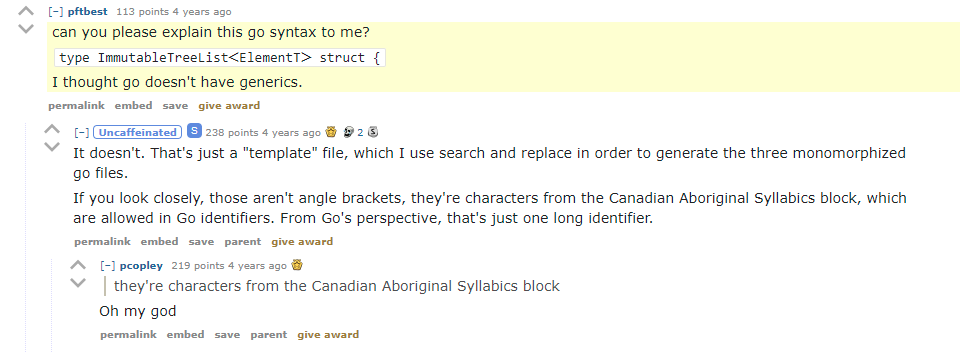
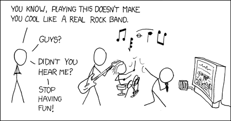

> # [Go is a compiled, concurrent, garbage-collected, statically typed language developed at Google.](https://talks.golang.org/2012/splash.article)


# Agenda

- History
- Basic features
- Web programming
- Goroutines and Channels
- Object-oriented programming

# History

## Why Go?

In 2007, three guys at Google were frustrated with the existing languages for writing server software:
- Compiling C++ was too slow
- Writing Java felt too verbose
- Getting concurrency right was hard
- Aversion against implementation inheritance and Design Patterns:

> *Design Patterns, Elements of Reusable Object-Oriented Software* (1994)
>
> The choice of programming language is important because it influences one's point of view.
> Our patterns assume Smalltalk/C++-level language features, and that choice determines what can and cannot be implemented easily.
> **If we assumed procedural languages, we might have included design patterns called "Inheritance," "Encapsulation," and "Polymorphism."**

```c
struct Animal {
    // polymorphism
    struct Animal_vtable {
        const char* (*noise)(const struct Animal*);
    };
    const struct Animal_vtable* vptr; // configured by "constructors"

    char name[16];
};

void chat(struct Animal* animal) {
    ///////////////////////////////////////////// polymorphism
    printf("%s says: %s\n", animal->name, animal->vptr->noise(animal));
}

struct Cow {
    // inheritance
    struct Animal base;
};
```

complete example in `code/Animal.c`

> Similarly, some of our patterns are supported directly by the less common object-oriented languages.
> **CLOS has multi-methods, for example, which lessen the need for a pattern such as Visitor.**

```java
class Shape {
    public boolean intersects(Shape  that) { 1 }
    public boolean intersects(Circle that) { 2 }
    public boolean intersects(Line   that) { 3 }
}

class Circle extends Shape {
    public boolean intersects(Shape  that) { 4 }
    public boolean intersects(Circle that) { 5 }
    public boolean intersects(Line   that) { 6 }
}

class Line extends Shape {
    public boolean intersects(Shape  that) { 7 }
    public boolean intersects(Circle that) { 8 }
    public boolean intersects(Line   that) { 9 }
}

Shape circle = new Circle();
Shape line   = new Line();
circle.intersects(line); // Which method is called?
```

```clj
(defmulti intersect?
  (fn [^Shape a, ^Shape b]
                     (type a) (type b)))

(defmethod intersect? [Circle Circle]
  ([a b] ...))

(defmethod intersect? [Circle Line  ]
  ([a b] ...))

(defmethod intersect? [Line   Circle]
  ([a b] ...))

(defmethod intersect? [Line   Line  ]
  ([a b] ...))
```

Nicolai Parlog (Java Developer Advocate at Oracle) – [Visitor Pattern Considered Pointless, Use Pattern Switches Instead](https://nipafx.dev/java-visitor-pattern-pointless)

> In fact, there are enough differences between Smalltalk and C++ to mean that some patterns can be expressed more easily in one language than the other. (**See Iterator for example.**)

Iterators (pattern) have been superseded by Generators (language feature)
- Python 2.2 (`yield` since 2001)
- C# 2.0 (`yield return` since 2005)
- EcmaScript 6 (`yield` since 2015)
- Kotlin 1.3 (`suspend`/`yield()` since 2018)

### C++

```cpp
// Within large projects, popular header files
// get included thousands of times and hence
// have to be recompiled over and over again
#include <iostream>
#include <string>
#include <vector>
```


### Java

```java
public class PersonBean {
	private String name;
	private int age;

	public PersonBean(String name, int age) {
		this.name = name;
		this.age = age;
	}

	public String getName() {
		return name;
	}

	public void setName(String name) {
		this.name = name;
	}

	public int getAge() {
		return age;
	}

	public void setAge(int age) {
		this.age = age;
	}

	@Override
	public String toString() {
		return "PersonBean [name=" + name + ", age=" + age + "]";
	}

	@Override
	public int hashCode() {
		final int prime = 31;
		int result = 1;
		result = prime * result + age;
		result = prime * result + ((name == null) ? 0 : name.hashCode());
		return result;
	}

	@Override
	public boolean equals(Object obj) {
		if (this == obj)
			return true;
		if (obj == null)
			return false;
		if (getClass() != obj.getClass())
			return false;
		PersonBean other = (PersonBean) obj;
		if (age != other.age)
			return false;
		if (name == null) {
			if (other.name != null)
				return false;
		} else if (!name.equals(other.name))
			return false;
		return true;
	}
}
```

Rob Pike: [Public Static Void](https://www.youtube.com/watch?v=5kj5ApnhPAE) at OSCON 2010

```kt
data class PersonBean(val name: String, val age: Int)
```

## Design

- Initial design by 3 people with different backgrounds:
  - Rob Pike (Concurrency)
  - Robert Griesemer (Modules)
  - Ken Thompson (Operating Systems)
- All design decisions had to be agreed upon unanimously
- Design team later joined by more people at Google

## Philosophy

- Simplicity
- Fast compilation
- Communicating sequential processes
- Interfaces yay, Inheritance nay
- No radical changes after Go 1.0
- Generics finally arriving in Go 1.18



## Prerequisites

- Download from https://golang.org/dl and install
  - or use https://play.golang.org for simple examples
- Visual Studio Code with https://marketplace.visualstudio.com/items?itemName=golang.Go
  - Other popular text editors have good support, too
  - https://www.jetbrains.com/go requires license

### Hello World

```go
package main

import "fmt"

func main() {
	fmt.Println("hello world")
}
```

- The `import` declaration imports entire packages
- All imported names must be qualified
- Uppercase names are visible to other packages
- Unused imports are compile-time errors!

```bash
$ go run hello.go
```

## Commands

- `go build` compile packages and dependencies
- `go clean` remove object files and cached files
- `go fix` update packages to use new APIs
- `go fmt` gofmt (reformat) package sources
- `go get` add dependencies to current module and install them
- `go mod` module maintenance
- `go run` compile and run Go program
- `go test` test packages
- ...

### Tools

- Coverage
  - `go test -coverprofile=coverage.out`
  - `go tool cover -html=coverage.out`
- Tracing
  - `go run -trace=trace.out`
  - `go tool trace trace.out`
- ...

# Basic features

## Keywords

```
if         switch      select   func     map      package
else       case        chan     var      type      import
for        default     go       defer    struct     const
range      break                return   interface
continue   fallthrough
goto
```

## Constants

```go
true        false       nil         iota
```

## Functions

```go
new        len          complex     panic
make       cap          real        recover
close      append       imag
           copy 
           delete
```

## Basic types

```go
 int    int8    int16    int32    int64
uint   uint8   uint16   uint32   uint64   uintptr

  float32     float64
complex64  complex128

bool   byte    rune     string   error
```

- `int` and `uint` are platform-dependent
- `byte` is the same as `uint8`
- `rune` is the same as `uint32`
- `uintptr` is large enough to hold pointers
- `error` is a special type for error handling

## Operators

```go
*   /   %   &   &^  <<  >>
+   -   ^   |
==  !=  <   <=  >   >=
&&
||
```

- only 5 precedence levels!
- `^` is both bitwise-xor (infix) and bitwise-not (prefix)
- `&^` is bitwise-andn

## Declarations

```go
// three semantically identical alternatives
var a int = 0
var b int
var c = 0

// fourth alternative, only available for local variables
d := 0
```

## Strings

```go
func main() {
	s := "Käsebrötchen"
	fmt.Println(s)
	fmt.Println(len(s))              // 14
	fmt.Println(hex.Dump([]byte(s))) // |K..sebr..tchen|

	// loop over the bytes (UTF-8 code units)
	for i := 0; i < len(s); i++ {
		fmt.Printf("%02d: %c\n", i, s[i])
	}
	fmt.Println()
	// loop over the runes (Unicode code points)
	for i, r := range s {
		fmt.Printf("%02d: %c\n", i, r)
	}
}
```

## Arrays

```go
func initPrimes(a [4]int) {
	// a is an array of 4 ints
	a[0] = 2
	a[1] = 3
	a[2] = 5
	a[3] = 7
	fmt.Println(a)  // [2 3 5 7]
}

func main() {
	var x [4]int    // arrays have a fixed size
	initPrimes(x)   // arrays are passed by value!
	fmt.Println(x)  // [0 0 0 0]
}
```

## Pointers

```go
func initPrimes(p *[4]int) {
	// p is a pointer to an array of 4 ints
	p[0] = 2
	p[1] = 3
	p[2] = 5
	p[3] = 7
	fmt.Println(*p) // [2 3 5 7]
}

func main() {
	var x [4]int
	initPrimes(&x)  // &x is a pointer to x
	fmt.Println(x)  // [2 3 5 7]
}
```

## Slices

```go
func initPrimes(s []int) {
	// s is a slice (view) into an array of ints
	s[0] = 2
	s[1] = 3
	s[2] = 5
	s[3] = 7
	fmt.Println(s)  // [2 3 5 7]
}

func main() {
	var x [8]int
	// x[b:e] is a slice into x, starting at b, ending at e
	// b defaults to 0, e defaults to len(x)
	initPrimes(x[2:6])
	fmt.Println(x)  // [0 0 2 3 5 7 0 0]
}
```

### Mental C model

```c
struct SliceInt {
	int*   ptr;
	size_t len;
	size_t cap;
};
```

### Slices can grow

```go
const N = 100

func main() {
	var compound [N]bool
	for i := 2; i * i < N; i++ {
		if !compound[i] {
			for j := i * i; j < N; j += i {
				compound[j] = true
			}
		}
	}
	var primes []int
	for i := 2; i < N; i++ {
		if !compound[i] {
			primes = append(primes, i)
		}
	}
	fmt.Println(primes)
}
```

## Exercises

1. Extract two functions from the last `main` function:
   - `markCompounds`
   - `gatherPrimes`
2. Determine the growth strategy of `append` by printing after each call:
   - either a pointer to the first element, or
   - the result of calling the special `cap` function

## Maps

```go
func main() {
	birth := map[string]int{
		"C":    1972,
		"C++":  1983,
		"Java": 1994,
	}
	for language, year := range birth {
		fmt.Printf("%s was born in %d\n", language, year)
	}
	birth["Go"] = 2007
	examine(birth, "Go")
	delete(birth, "Go")
	examine(birth, "Go")
}

func examine(birth map[string]int, language string) {
	if year, ok := birth[language]; ok {
		fmt.Printf("%s was born in %d\n", language, year)
	} else {
		fmt.Printf("Never heard of %s...\n", language)
	}
}
```

## Exercise

- Write a function that counts the occurrences of all characters in a given string
  - Which value does map lookup return for missing keys?

## Structs

```go
type Person struct {
	Name string
	Age  int
}

func main() {
	alice := Person{"Alice", 21}

	bob := alice
	bob.Name = "Bob"
	bob.Age++

	fmt.Printf( "%v\n", alice) // {Alice 21}
	fmt.Printf("%#v\n", bob)   // main.Person{Name:"Bob", Age:22}
}
```

- Structs have value semantics, just like in C#
- Reference semantics require explicit pointers:

```go
type Person struct {
	Name string
	Age  int
}

func main() {
	myBoss := &Person{"Guido", 60}

	yourBoss := myBoss
	yourBoss.Age++

	fmt.Println(myBoss, yourBoss) // &{Guido 61} &{Guido 61}
}
```

# Web programming

## Web client

```go
package main

import (
	"encoding/json"
	"errors"
	"fmt"
	"net/http"
)

// full spec at https://xkcd.com/json.html
type Xkcd struct {
	Title string
	Hover string `json:"alt"`
}

func FetchCurrentXkcdComic() (*Xkcd, error) {
	response, err := http.Get("https://xkcd.com/info.0.json")
	if err != nil {
		return nil, err
	}
	defer response.Body.Close()
	if response.StatusCode != http.StatusOK {
		return nil, errors.New(response.Status)
	}
	var xkcd Xkcd
	decoder := json.NewDecoder(response.Body)
	if err := decoder.Decode(&xkcd); err != nil {
		return nil, err
	}
	return &xkcd, nil
}

func main() {
	xkcd, err := FetchCurrentXkcdComic()
	if err != nil {
		fmt.Println(err)
	} else {
		fmt.Printf("%s\n\n%s\n", xkcd.Title, xkcd.Hover)
	}
}
```

## Exercise

- Fetch the 3 most recent XKCD comics and print additional information of your choice

## Web server

```go
package main

import (
	"fmt"
	"net/http"
)

func main() {
	http.HandleFunc("/", root)
	fmt.Println("waiting for requests...")
	http.ListenAndServe(":8080", nil)
}

var counter = 0

func root(writer http.ResponseWriter, request *http.Request) {
	fmt.Printf("%s\n\n", request)
	counter++
	fmt.Fprintf(writer, "<html><body><pre>")
	fmt.Fprintln(writer, request.URL.Path)
	fmt.Fprintf(writer, "%d visits\n", counter)
	fmt.Fprintf(writer, "</pre></body></html>")
}
```

- Compiles and appears to run fine
- Where is the bug?

### Mutex

```go
import "sync"

var counter = 0
var mutex sync.Mutex

func root(writer http.ResponseWriter, request *http.Request) {
	fmt.Printf("%s\n\n", request)

	mutex.Lock()
	counter++
	count := counter
	mutex.Unlock()

	fmt.Fprintf(writer, "<html><body><pre>")
	fmt.Fprintln(writer, request.URL.Path)
	fmt.Fprintf(writer, "%d visits\n", count)
	fmt.Fprintf(writer, "</pre></body></html>")
}
```

### defer

```go
func root(writer http.ResponseWriter, request *http.Request) {
	fmt.Printf("%s\n\n", request)

	mutex.Lock()
	defer mutex.Unlock()
	counter++
	count := counter

	fmt.Fprintf(writer, "<html><body><pre>")
	fmt.Fprintln(writer, request.URL.Path)
	fmt.Fprintf(writer, "%d visits\n", count)
	fmt.Fprintf(writer, "</pre></body></html>")
}
```

### Immediately invoked function expression

```go
func root(writer http.ResponseWriter, request *http.Request) {
	fmt.Printf("%s\n\n", request)

	count := func() int {
		mutex.Lock()
		defer mutex.Unlock()
		counter++
		return counter
	}()

	fmt.Fprintf(writer, "<html><body><pre>")
	fmt.Fprintln(writer, request.URL.Path)
	fmt.Fprintf(writer, "%d visits\n", count)
	fmt.Fprintf(writer, "</pre></body></html>")
}
```

### Atomic add

```go
import "sync/atomic"

var counter int32

func root(writer http.ResponseWriter, request *http.Request) {
	fmt.Printf("%s\n\n", request)

	count := atomic.AddInt32(&counter, 1)

	fmt.Fprintf(writer, "<html><body><pre>")
	fmt.Fprintln(writer, request.URL.Path)
	fmt.Fprintf(writer, "%d visits\n", count)
	fmt.Fprintf(writer, "</pre></body></html>")
}
```

## Exercise

- Write a web server that generates a web page with 3 random XKCD comics




# Goroutines and Channels

## Goroutines

- Goroutines are "lightweight threads"
  - 2 kib of initial stack space
  - function call overhead 3 CPU instructions
  - 10,000 or 100,000 goroutines? No problem!
- Goroutines support *parallel programming* (multicore optimization)
  - But primary motivation is *concurrent programming* (concurrency by design)
- Goroutines make *asynchronous programming* largely redundant
  - IO without callbacks, promises, futures, observables, subscribe, async/await etc.

```go
func count(animal string, n int) {
	for i := 1; i <= n; i++ {
		time.Sleep(time.Duration(400+rand.Intn(200)) * time.Millisecond)
		fmt.Println(i, animal)
	}
}

func main() {
	rand.Seed(time.Now().UnixNano())

	go count("sheep", 10)
	go count("cat", 10)
	go count("dog", 10)

	fmt.Println("zzzZZZzzz")
}
```

- The program ends when `main` ends
- Nonsolution: Sleep before ending `main`

```go
func main() {
	rand.Seed(time.Now().UnixNano())

	go count("sheep", 10)
	go count("cat", 10)
	go count("dog", 10)

	time.Sleep(5 * time.Second)

	fmt.Println("zzzZZZzzz")
}
```

## WaitGroup

```go
var wg sync.WaitGroup

func count(animal string, n int) {
	defer wg.Done() // decrement counter when done
	for i := 1; i <= n; i++ {
		time.Sleep(time.Duration(400+rand.Intn(200)) * time.Millisecond)
		fmt.Println(i, animal)
	}
}

func main() {
	rand.Seed(time.Now().UnixNano())

	wg.Add(3) // initialize counter to 3
	go count("sheep", 10)
	go count("cat", 10)
	go count("dog", 10)
	wg.Wait() // block until counter is 0

	fmt.Println("zzzZZZzzz")
}
```

- WaitGroups can be reused, hence global variables are idiomatic
- Alternatively, pass pointer (!) into goroutine

## Channels, selection and timeouts

- Sender goroutine communicates data to Receiver goroutine via Channel
- Usage:
  - Send: `channel <- data`
  - Receive: `<-channel`
- Types:
  - `chan T` send/receive
  - `<-chan` receive-only
  - `chan<-` send-only
- Creation:
  - Unbuffered: `make(chan T)`
    - send blocks until receive
	- receive blocks until send
  - Buffered: `make(chan T, size)`
    - send blocks while buffer full
	- receive blocks while buffer empty

```go
func count(animal string, n int, messages chan<- string) {
	for i := 1; i <= n; i++ {
		time.Sleep(time.Duration(400+rand.Intn(200)) * time.Millisecond)
		messages <- fmt.Sprintf("%d %s", i, animal)
	}
}

func main() {
	rand.Seed(time.Now().UnixNano())

	messages := make(chan string)

	go count("sheep", 10, messages)
	go count("cat", 10, messages)
	go count("dog", 10, messages)

	var deadline <-chan time.Time = time.After(10 * time.Second)
receiving:
	for {
		// blocks until any case is ready (in absence of default case)
		select {
		case message := <-messages:
			fmt.Println(message)

		case <-deadline:
			fmt.Println("deadline")
			break receiving

		case <-time.After(time.Second):
			fmt.Println("channel dead for 1 second")
			break receiving
		}
	}

	fmt.Println("zzzZZZzzz")
}
```

## Closing channels

```go
func main() {
	rand.Seed(time.Now().UnixNano())

	messages := make(chan string)
	wg.Add(3)
	go func() {
		wg.Wait()
		close(messages)
	}()

	go count("sheep", 10, messages)
	go count("cat", 10, messages)
	go count("dog", 10, messages)

	for {
		message, sentBeforeClose := <-messages
		if !sentBeforeClose {
			fmt.Println("channel closed")
			break
		}
		fmt.Println(message)
	}

	fmt.Println("zzzZZZzzz")
}
```

- Data sent before closing is still receivable

## Iterating over channels

```go
func main() {
	rand.Seed(time.Now().UnixNano())

	messages := make(chan string)
	wg.Add(3)
	go func() {
		wg.Wait()
		close(messages)
	}()

	go count("sheep", 10, messages)
	go count("cat", 10, messages)
	go count("dog", 10, messages)

	for message := range messages {
		fmt.Println(message)
	}

	fmt.Println("zzzZZZzzz")
}
```

## Simulating WaitGroups with channels

```go
func count(animal string, n int, messages chan<- string, done chan<- time.Time) {
	defer func() {
		done <- time.Now()
	}()
	for i := 1; i <= n; i++ {
		time.Sleep(time.Duration(400+rand.Intn(200)) * time.Millisecond)
		messages <- fmt.Sprintf("%d %s", i, animal)
	}
}

func main() {
	rand.Seed(time.Now().UnixNano())

	messages := make(chan string)
	done := make(chan time.Time)
	go func() {
		<-done
		<-done
		<-done
		close(messages)
	}()

	go count("sheep", 10, messages, done)
	go count("cat", 10, messages, done)
	go count("dog", 10, messages, done)

	for message := range messages {
		fmt.Println(message)
	}

	fmt.Println("zzzZZZzzz")
}
```

## Exercise

- Have your web server fetch the random XKCD comics concurrently

# Object-oriented programming

## Circles and Rectangles

```go
package main

import (
	"fmt"
	"math"
)

type Circle struct {
	Radius float64
}

type Rectangle struct {
	Width  float64
	Height float64
}

func areaCircle(circ *Circle) float64 {
	return math.Pi * circ.Radius * circ.Radius
}

// We need distinct function names for areas
// because Go does not support overloading

func areaRectangle(rect *Rectangle) float64 {
	return rect.Width * rect.Height
}

func main() {
	c := Circle{Radius: 2}
	r := Rectangle{Width: 16, Height: 9}

	fmt.Printf("%#v -> %f\n", c, areaCircle(&c))
	fmt.Printf("%#v -> %f\n", r, areaRectangle(&r))
}
```

## Methods

```go
func (circ *Circle) Area() float64 {
	return math.Pi * circ.Radius * circ.Radius
}

// Methods have an additional receiver argument
// and can be overloaded by their receiver

func (rect *Rectangle) Area() float64 {
	return rect.Width * rect.Height
}

func main() {
	c := Circle{Radius: 2}
	r := Rectangle{Width: 16, Height: 9}

	fmt.Printf("%#v -> %f\n", c, c.Area())
	fmt.Printf("%#v -> %f\n", r, r.Area())
}
```

## Interfaces

```go
type Shape interface {
	Area() float64
}

// *Circle and *Rectangle implicitly implement Shape
// because they provide an Area() float64 method

func main() {
	shapes := [...]Shape{
		&Circle{Radius: 2},
		&Rectangle{Width: 16, Height: 9},
	}

	for _, shape := range shapes {
		fmt.Printf("%#v -> %f\n", shape, shape.Area())
	}
}
```

### Stringer

```go
/*
package fmt

type Stringer interface {
	String() string
}
*/
type Shape interface {
	fmt.Stringer
	Area() float64
}

func (circ *Circle) String() string {
	return fmt.Sprintf("(%f)", circ.Radius)
}

func (rect *Rectangle) String() string {
	return fmt.Sprintf("[%f x %f]", rect.Width, rect.Height)
}

func main() {
	shapes := [...]Shape{
		&Circle{Radius: 2},
		&Rectangle{Width: 16, Height: 9},
	}

	for _, shape := range shapes {
		fmt.Printf("%s -> %f\n", shape.String(), shape.Area())
	}
}
```

## Exercise

- Implement 2 additional shapes: `Square` and `Triangle`

# Bonus

## Cross compilation

- Set 2 environment variables for the target:
  - `GOOS` (aix, android, darwin (macOS and iOS), dragonfly, freebsd, hurd, illumos, js, linux, netbsd, openbsd, plan9, solaris, windows, zos)
  - `GOARCH` (probably amd64, arm64 or 386)
- `go tool dist list` shows all supported platforms
- See https://golang.org/doc/install/source for details

## Structure of a Go Program

- Be as simple as possible, but not simpler than that!
- Use a structure that works best for you
- It is a valid approach to keep everything in one single package
- Domain Driven Design works in Go, too
- [Kat Zien – How Do You Structure Your Go Apps](https://www.youtube.com/watch?v=oL6JBUk6tj0)

## Mob exercise

- Invoke the function `F` from the `wps2go` module:
  - `github.com/amller-wps/wps2go`

## Where do we Go now?

https://golang.org/doc

https://pkg.go.dev/std

https://go-proverbs.github.io

https://go.dev/blog

https://gobyexample.com

https://forum.golangbridge.org

https://groups.google.com/g/golang-nuts

http://www.gopl.io
